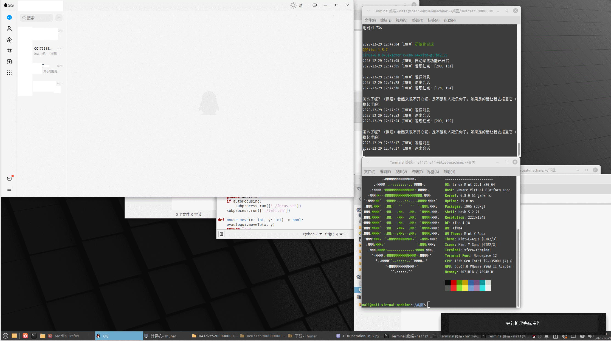

# 🐧 在 Linux 上运行 QQPilot（v1.5.7+）
  
> 本教程适用于带有 **图形桌面环境** 的 Linux 系统（如 xfce4 等）。纯窗口管理器（如 i3、dwm）未经测试，可能无法正常运行。


---

## ✅ 当前限制（Linux 版）

- ❌ **不支持上传图片**
- ❌ **不包含“下载助手”功能**（该功能仅限 Windows）
- ⚠️ 对高 DPI 缩放兼容性有限

## ⚠️ 注意
>WSL版本不支持，你完全可以用Windows版的QQPilot。

---

## 📦 准备工作

### 1. 安装 QQ for Linux
前往官方页面下载并安装：
👉 [https://im.qq.com/linuxqq/index.shtml](https://im.qq.com/linuxqq/index.shtml)

确保能正常启动并登录。

---

### 2. 安装 `uv`（Python 包 & 版本管理工具）

`uv` 是由 Astral 开发的超快 Python 工具链，用于替代 `pip` + `pyenv`。
[国内加速脚本](uv-installer2.sh)

```bash
# 官方安装（可能较慢）
curl -LsSf https://astral.sh/uv/install.sh | sh

# 或使用国内加速脚本（推荐）
chmod +x uv-installer2.sh
./uv-installer2.sh
```

> 安装后请重启终端。

---

### 3. 安装 Python 3.13+（带 Tkinter 支持）

⚠️ **不要使用系统自带的 Python**！很多发行版默认 Python 缺少 `tkinter`，会导致 GUI 相关功能失败。

```bash
# 设置国内镜像加速 Python 二进制下载
export UV_PYTHON_INSTALL_MIRROR=https://mirror.nju.edu.cn/github-release/indygreg/python-build-standalone

# 安装 Python 3.13（QQPilot 推荐版本）
uv python install 3.13

# 验证安装
uv python list
```

---

## 🛠️ 安装 QQPilot

### 4. 下载并解压 QQPilot

从 Releases 页面下载 **Linux 版 ZIP 包**，然后解压：

```bash
unzip *.zip -d QQPilot
cd QQPilot
```

---

### 5. 创建虚拟环境并激活

```bash
uv venv ./venv
source ./venv/bin/activate
chmod +x ./*.sh  # 确保脚本可执行
```

---

### 6. 安装 Python 依赖

```bash
# 使用清华源加速 pip 安装
uv pip install -r requirements.txt -i https://pypi.tuna.tsinghua.edu.cn/simple
```

### 7. 安装系统依赖

QQPilot 依赖以下系统组件：

```bash
# 用于 pyperclip（剪贴板操作）
sudo apt install xclip

# 用于 pyautogui（模拟键盘/鼠标）
sudo apt install python3-tk python3-xlib

# （可选）如果你使用截图功能，确保有屏幕捕获权限
# 某些桌面环境（如 Wayland）可能需要额外配置
```

> 💡 **Wayland 用户注意**：`pyautogui` 在 Wayland 下通常无法工作。建议切换到 **X11 会话**（登录时选择 “GNOME on Xorg” 等）。

---

## ▶️ 运行 QQPilot

项目提供三个核心脚本：

| 脚本 | 功能 |
|------|------|
| `option.sh` | 配置模型类型、API 地址、截图区域等 |
| `ExtensionManager.sh` | 管理自定义扩展模块 |
| `run.sh` | 启动主程序 |

```bash
./option.sh    # 首次运行建议先配置
./run.sh       # 启动机器人
```

---

## 🧠 推荐：启用本地大模型（Ollama）

为提升隐私与响应速度，建议使用本地 LLM：

```bash
# 安装 Ollama（参考 https://ollama.com/）
curl -fsSL https://ollama.com/install.sh | sh

# 拉取推荐模型（8B 平衡版）
ollama pull huihui_ai/deepseek-r1-abliterated:8b

# 在 option.sh 中选择 "Ollama" 作为模型类型，并填写模型名
```

> ⚠️ 视觉多模态模型（如 `qwen3-vl`）目前效果不佳，**强烈建议使用纯文本模型**。

---

## ⚙️ QQ 客户端优化设置（提高识别准确率）

| 设置项             | 推荐值                     |
|--------------------|---------------------------|
| 联系人面板宽度     | 拖动至 **最窄**            |
| 自动更新           | **关闭**                   |
| 字体大小           | 设为 **“最小”**            |
| 聊天背景           | 使用 **默认白色背景**      |
| 系统显示缩放       | **必须为 100%**（不可缩放）|

> 🔍 QQPilot 通过 UI 坐标识别消息，任何界面变动（如缩放、深色主题）都可能导致识别失败。

---

## 最后
~~安装neofetch之类的程序查看你的Linux发行版版本并炫耀~~
   


## 🎉 完成！

现在你可以让 QQPilot在Linux下自动监听 QQ 消息、调用大模型生成回复，并自动发送！

🌟 **小贴士**：  
- 确保 QQ 窗口处于 **前台且未最小化**。   

--- 

✅ 祝你使用愉快！