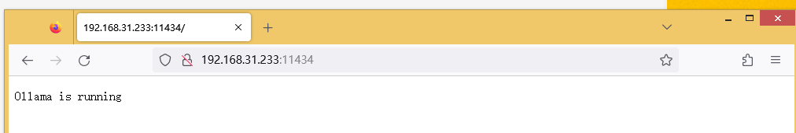
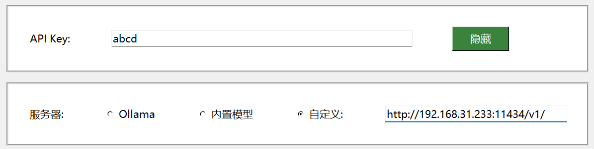
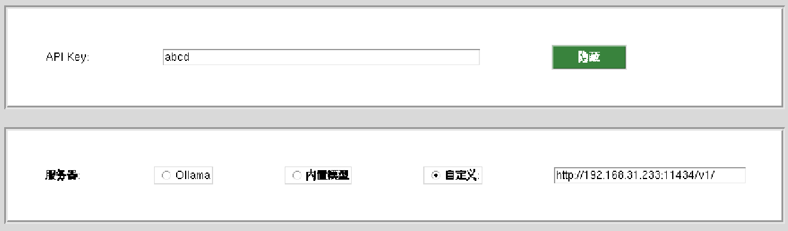
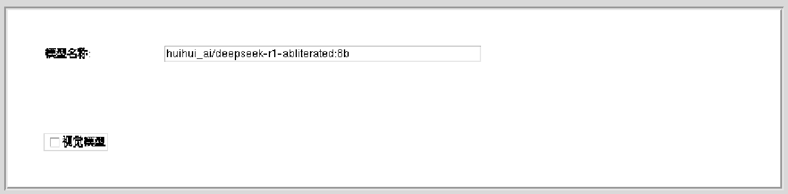

# 在虚拟机中调用主机上的 Ollama 服务（Windows 主机）

本教程将指导你如何在虚拟机（如 VMware、VirtualBox 等）中访问运行在 **Windows 主机** 上的 Ollama 服务，从而避免在虚拟机中重复部署模型。

适用于VisionQQ/QQPilot 1.5+

> 💡 前提条件：
> - 主机已安装并能正常运行 [Ollama](https://ollama.com/)
> - 虚拟机与主机处于同一局域网（推荐使用 **NAT 网络模式**）
> - 主机防火墙允许外部设备访问端口 `11434`

---

## 第一步：配置主机以允许外部访问 Ollama

每次需要从虚拟机访问 Ollama 前，请在 **主机** 上执行以下操作：

1. **关闭正在运行的 Ollama 进程**  
   以管理员身份打开 **命令提示符 (CMD)**，依次执行：

   ```cmd
   taskkill /F /IM ollama.exe
   taskkill /F /IM "ollama app.exe"
   ```
   或者打开终端
   ```bash
   sudo systemctl stop ollama
   ```

2. **设置环境变量并启动服务**  
   在同一个 CMD 窗口中继续输入：

   ```cmd
   set OLLAMA_HOST=0.0.0.0
   set OLLAMA_ORIGINS=*
   ollama serve
   ```
   或者在 Linux 上执行：
   ```bash
   export OLLAMA_HOST=0.0.0.0
   export OLLAMA_ORIGINS=*
   ollama serve
   ```

   > ⚠️ 安全提示：`OLLAMA_ORIGINS=*` 允许任意来源访问 API，仅建议在可信内网环境中使用。生产环境应限制为具体 IP 或域名。

   此时 Ollama 将监听所有网络接口（而不仅是 `localhost`），等待外部连接。

---

## 第二步：获取主机的局域网 IP 地址

1. 打开一个新的 CMD 窗口（不要关闭上一步的 `ollama serve` 窗口），运行：

   ```cmd
   ipconfig
   ```
   ```bash
   ifconfig
   #如果找不到ifconfig，请安装  net-tools
   ```

2. 找到当前活动的以太网或 Wi-Fi 适配器，记录其 **IPv4 地址**，例如：

   ```
   以太网适配器 以太网:
      IPv4 地址 . . . . . . . . . . . . : 192.168.31.233
   ```

3. **验证服务是否可远程访问**  
   在浏览器中访问：

   ```
   http://192.168.31.233:11434
   ```

   或在 CMD / Bash 中执行：

   ```cmd
   curl http://192.168.31.233:11434
   ```

   若返回 `Ollama is running`，说明配置成功 ✅

   

   > 📌 注意：确保 Windows 防火墙未阻止 `11434` 端口。如有需要，请手动添加入站规则。

---

## 第三步：在虚拟机中配置 Ollama 客户端

1. **确认虚拟机网络模式为 NAT**（默认通常即为此模式），确保能与主机通信。

2. **配置 API 地址**  
   在设置中，将 Ollama 服务器地址设为：

   ```
   http://<主机IPv4地址>:11434/v1/
   ```

   例如：
   ```
   http://192.168.31.233:11434/v1/
   ```
   
<!--  -->
    

   > 🔑 注意：OpenAI-Python要求填写 API Key，即使 Ollama 本身不需要。此时可随意填写非空值（如 `dummy-key`），只要不为 `None` 或留空即可。
   

3. **查看可用模型名称**  
   回到主机的 CMD / Bash 中（非虚拟机），运行：

   ```cmd
   ollama ls
   ```

   输出示例：
   ```
   NAME                                      ID              SIZE      MODIFIED
   huihui_ai/deepseek-r1-abliterated:8b      5ae823b61e22    5.0 GB    5 months ago
   gemma3:4b                                 b9620af37e65    8.6 GB    5 months ago
   ```

   复制你想要使用的完整 `NAME`（包括命名空间和标签），填入虚拟机客户端的“模型名称”字段。




* 使用时你应该可以看到
```bash
ollama ps
NAME                                    ID              SIZE      PROCESSOR    CONTEXT    UNTIL
huihui_ai/deepseek-r1-abliterated:8b    5ae823b61e22    5.8 GB    100% GPU     4096       4 minutes from now
```
---

## 常见问题排查

- ❌ 虚拟机无法访问 `http://<IP>:11434`？
  - 检查主机防火墙是否放行 `11434` 端口。
  - 确保 `ollama serve` 仍在运行且设置了 `OLLAMA_HOST=0.0.0.0`。
  - 在虚拟机中 `ping <主机IP>` 测试连通性。

- ❌ 客户端报错 “Invalid API key”？
  - 即使 Ollama 不验证 API Key，某些前端仍要求填写。请确保字段非空。

- 🔄 想要持久化配置？
  - 可将环境变量写入系统（通过“系统属性 → 环境变量”），但需注意安全风险。
  - 更推荐编写一个启动脚本（`.bat` 文件）自动完成 kill + serve 流程。

---

✅ 完成以上步骤后，你的虚拟机即可无缝调用主机上运行的 Ollama 模型，节省资源并统一管理！
<!-- [](image-2.png) -->

